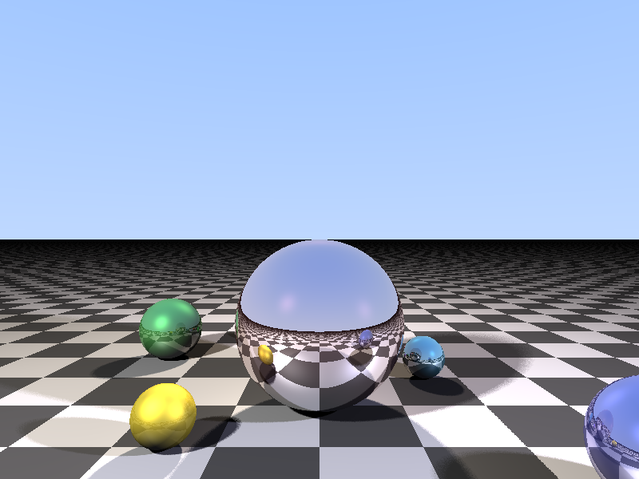

# C++20 Raytracer with Progress Spinner

This project is a modern C++20 raytracer that generates a 3D scene with spheres, reflections, and lighting. It includes a progress spinner to show rendering progress and estimated time remaining.

## Sample



## Features

- Implemented in C++20
- Ray tracing with reflections and specular highlights
- Soft shadows for more realistic lighting
- Checkerboard ground plane
- Multiple spheres and light sources
- Progress spinner with completion percentage, elapsed time, and ETA
- Multithreaded rendering using OpenMP

## Prerequisites

To build and run this project, you need:

- A C++20 compliant compiler (e.g., GCC 10+, Clang 10+, or MSVC 2019+)
- OpenMP for parallel processing
- stb_image_write.h (included in the project)

## Getting Dependencies

1. **Compiler**: 
   - On Ubuntu/Debian: `sudo apt-get install g++-10`
   - On macOS with Homebrew: `brew install gcc`
   - On Windows: Install the latest Visual Studio with C++ support

2. **OpenMP**:
   - On Ubuntu/Debian: It's usually included with GCC
   - On macOS: It's included with GCC from Homebrew
   - On Windows: It's included with Visual Studio

3. **stb_image_write.h**:
   This single-file library is already included in the project. However, if you want to update it to the latest version, you can run:
   ```
   curl -O https://raw.githubusercontent.com/nothings/stb/master/stb_image_write.h
   ```
   Run this command in your project directory to download the latest version of the header file.

## Building the Project

1. All dependencies, including `stb_image_write.h`, are already in your project directory.

2. Compile the project using the following command:

   For GCC:
   ```
   g++-10 -std=c++20 -O3 -fopenmp raytracer.cpp -o raytracer
   ```

   For Clang:
   ```
   clang++ -std=c++20 -O3 -fopenmp raytracer.cpp -o raytracer
   ```

   For MSVC (in Developer Command Prompt):
   ```
   cl /std:c++20 /O2 /openmp raytracer.cpp
   ```

## Usage

Run the compiled program:

```
./raytracer [max_bounces]
```

- `max_bounces` (optional): Maximum number of light bounces for reflections (default: 10)

The program will start rendering the scene and display a progress spinner in the console. Once complete, it will save the rendered image as `output.png` in the same directory.

## Customization

You can customize the scene by modifying the `main` function in `raytracer.cpp`:

- Adjust the `width` and `height` variables to change the image resolution
- Modify the camera position and field of view
- Add, remove, or modify spheres in the `spheres` vector
- Adjust lighting by modifying the `lights` vector

## Contributing

Contributions to improve the raytracer or add new features are welcome. Please feel free to submit pull requests or open issues for bugs and feature requests.

## License

This project is open-source and available under the MIT License. See the LICENSE file for more details.

## Acknowledgments

- [stb](https://github.com/nothings/stb) for the `stb_image_write.h` library
- The raytracing community for providing educational resources on the topic
